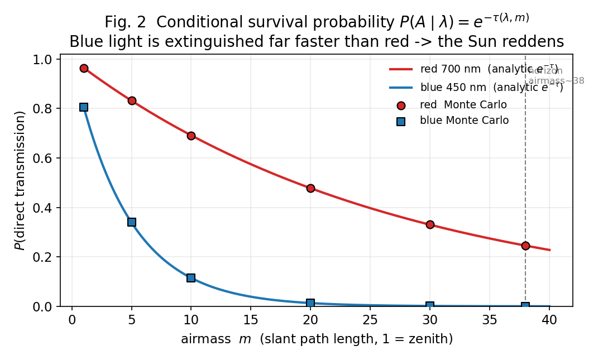
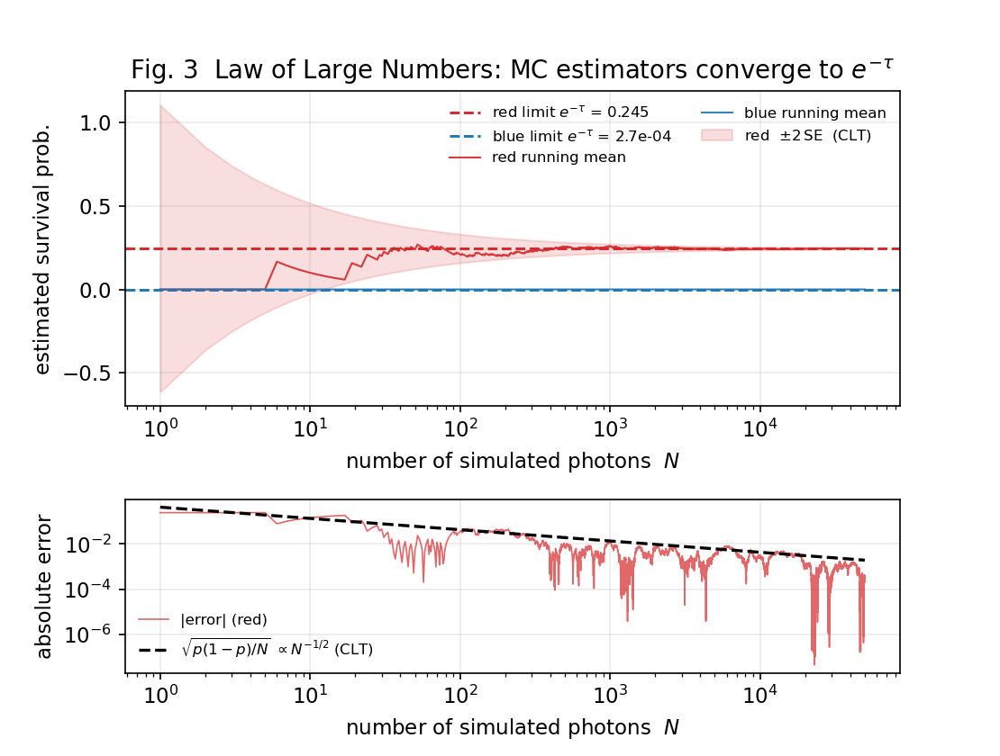
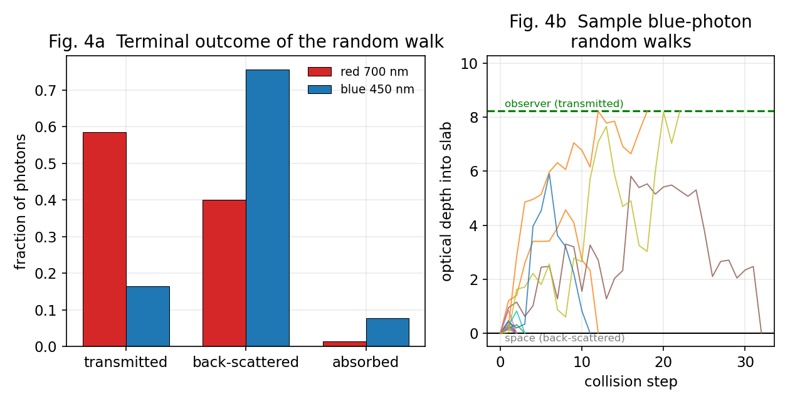
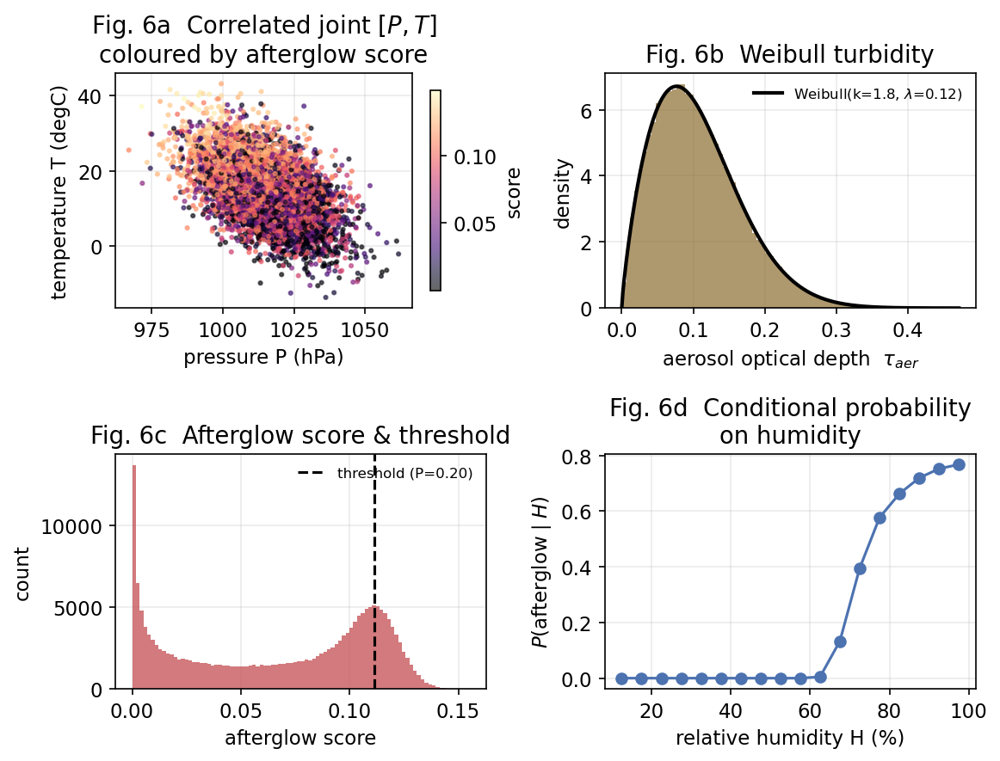

# 🌅 Stochastic Modeling of Sunset Afterglow Probability

> Why is the sunset red? This project answers it with **probability theory** instead of
> deterministic physics — modeling each photon as a random walk through the atmosphere and
> recovering the colour of the sky as an *expectation* over a Monte Carlo ensemble.

A course project for **Probability Theory and Stochastic Processes**. Atmospheric Rayleigh
scattering is reframed as a continuous-time stochastic process: a photon's free path is an
**Exponential** random variable, wavelength-dependent extinction is a **conditional survival
probability**, and the appearance of a vivid afterglow is a **joint-threshold event** on a
correlated weather vector. A Monte Carlo simulator validates the analytic results, demonstrates
the **Law of Large Numbers** and **Central Limit Theorem**, and — as an extension — renders the
*actual perceived colour* of the setting Sun.

📄 **[Read the full report (PDF)](report/Sunset_Afterglow_Report.pdf)**

---

## ✨ Headline result: the colour of the sky, from probability alone

Transmitting the full solar spectrum through increasing atmospheric path length and converting
the survivors through the **CIE 1931** colour space reproduces the sunset's march from white to
crimson — driven entirely by the probability that a photon of each wavelength survives the journey.


At the horizon the direct beam renders to sRGB ≈ `[1.00, 0.42, 0.00]` — a vivid orange-red.

---

## 📐 The probabilistic model

| Phenomenon | Probabilistic object |
|---|---|
| Photon free path before a collision | **Exponential** r.v., sampled by inverse transform `X = −(1/λ)·ln U` |
| Survival across path length `L` | `P(X > L) = e^{−τ}` (Beer–Lambert) |
| Blue scatters more than red | `τ(λ) ∝ λ⁻⁴` → conditional survival `P(A│λ)` |
| Multiple scattering | **Random walk / Markov chain** with a collision decision tree |
| Atmospheric turbidity | **Weibull** random variable |
| "Will there be an afterglow?" | **Joint** threshold on a correlated `[P, T, H]` vector |

### Key numbers (from one seeded run)

- **Red vs blue survival at the horizon (airmass ≈ 38):** `P(red) = 0.245` vs `P(blue) = 2.7×10⁻⁴` — a **~917 : 1** advantage that *is* the reddening.
- **LLN / CLT:** Monte Carlo estimators converge to `e^{−τ}` with error shrinking as `N^{−1/2}`.
- **Conditional probability:** `P(afterglow │ humidity > 75%) = 0.68` vs ≈ `0.00` for dry air.

---

## 🖼️ Selected figures

| Conditional survival (why the Sun reddens) | Law of Large Numbers + CLT |
|---|---|
|  |  |

| Multiple-scattering random walk | Joint weather model & afterglow probability |
|---|---|
|  |  |

---

## 🚀 Reproduce it

```bash
pip install -r requirements.txt

python src/sunset_afterglow.py   # runs the Monte Carlo, writes figures/ and results.json
python src/build_report.py       # assembles report/Sunset_Afterglow_Report.pdf
```

Everything is driven by a single fixed PRNG seed, so results are fully reproducible, and the PDF
is generated programmatically from `results.json` — every number in the report is traceable to
the simulation.

## 🗂️ Repository layout

```
sunset-afterglow-probability/
├── src/
│   ├── sunset_afterglow.py   # Monte Carlo simulation engine + figure generation
│   └── build_report.py       # builds the PDF report from results.json + figures/
├── figures/                  # generated figures (PNG)
├── report/
│   └── Sunset_Afterglow_Report.pdf
├── results.json              # numeric summary of one seeded run
├── requirements.txt
└── README.md
```

## 📜 License

Released under the [MIT License](LICENSE).

---

*Author: John Douglas · individual coursework.*
