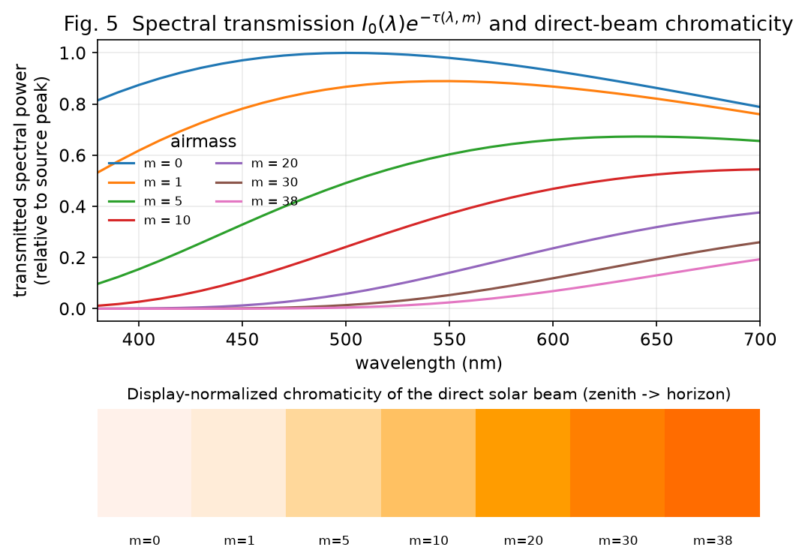

# 🌅 Stochastic Modeling of Sunset Afterglow

An interactive probability lab for exploring why the direct solar beam reddens
near the horizon. Photons receive Exponential free paths, wavelength-dependent
survival follows Beer-Lambert attenuation, and Monte Carlo ensembles expose the
Law of Large Numbers and Central Limit Theorem.

> **Model boundary:** this is an educational atmospheric-transmission model, not
> a forecast of whether tonight's sunset will be spectacular. The weather score
> is an explicit sensitivity experiment whose distributions and threshold are
> teaching assumptions, not parameters fitted to observations.

📄 **[Read the generated report](report/Sunset_Afterglow_Report.pdf)**

## Interactive lab

Launch the Streamlit app and adjust solar elevation, aerosol optical depth,
Ångström exponent, photon count, and random seed:

```bash
python -m pip install -r requirements.txt
streamlit run app.py
```

The lab updates analytic and Monte Carlo survival probabilities, the transmitted
spectrum, and the display-normalized direct-beam chromaticity. It explicitly
separates hue from apparent brightness and documents omitted physics.

## What the model demonstrates

| Phenomenon | Probabilistic object |
|---|---|
| Photon free path | Exponential random variable sampled by inverse transform |
| Direct transmission | `P(X > τ) = exp(-τ)` |
| Blue versus red attenuation | Rayleigh optical depth proportional to `λ⁻⁴` |
| Aerosol attenuation | Ångström power law with adjustable optical depth |
| Solar geometry | Kasten-Young relative airmass from solar elevation |
| Multiple scattering | Educational 1-D two-stream Markov random walk |
| Monte Carlo precision | Repeated-run RMSE proportional to `N⁻¹ᐟ²` |
| Weather sensitivity | Fixed-threshold score over an assumed joint distribution |



At the geometric horizon, the Rayleigh-only teaching example gives much greater
survival for 700 nm light than 450 nm light. This explains reddening of the
direct disk; it does **not** by itself predict the radiance or appearance of the
surrounding twilight sky.

## Reproduce the report

```bash
python src/sunset_afterglow.py
python src/build_report.py
```

Each experiment uses its own deterministic random-number stream, so running one
figure independently cannot perturb the results of another. Generated numerical
results are written to `results.json` and consumed by the report builder.

## Test and lint

```bash
python -m pip install -r requirements-dev.txt
pytest
ruff check .
```

GitHub Actions runs the suite on Python 3.10 and 3.12 and verifies that the
committed numerical results can be regenerated.

## Repository layout

```text
├── app.py                     # interactive Streamlit probability lab
├── src/
│   ├── sunset_afterglow.py    # model, Monte Carlo experiments, figures
│   └── build_report.py        # generated PDF report
├── tests/                     # scientific invariants and reproducibility tests
├── figures/                   # generated figures
├── report/                    # generated report
├── results.json               # seeded numerical summary
└── .github/workflows/ci.yml   # lint, tests, artifact check
```

## Scientific limitations

- The random walk is one-dimensional and cannot predict angular sky radiance.
- The chromaticity calculation normalizes brightness and omits ozone absorption,
  clouds, multiple-scattered skylight, visual adaptation, and camera response.
- Humidity is used as a deliberately explicit teaching proxy; it is not evidence
  of predictive skill.
- A real forecast requires labelled sunset observations matched to solar geometry,
  aerosol measurements, cloud layers, visibility, and observer ratings, followed
  by out-of-sample calibration checks such as Brier score and reliability plots.

## References

- Kasten, F. & Young, A. T. (1989), *Revised optical air mass tables and
  approximation formula*, Applied Optics 28(22), 4735-4738.
- Bodhaine, B. A. et al. (1999), *On Rayleigh Optical Depth Calculations*,
  Journal of Atmospheric and Oceanic Technology 16, 1854-1861.
- CIE 015:2018, *Colorimetry, 4th Edition*.

Released under the [MIT License](LICENSE).
